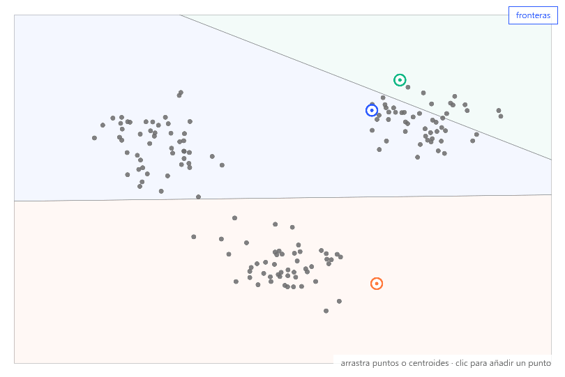
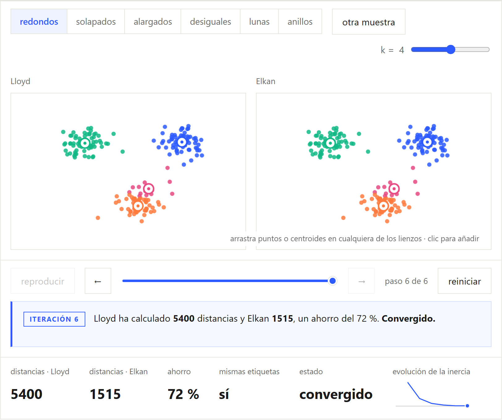
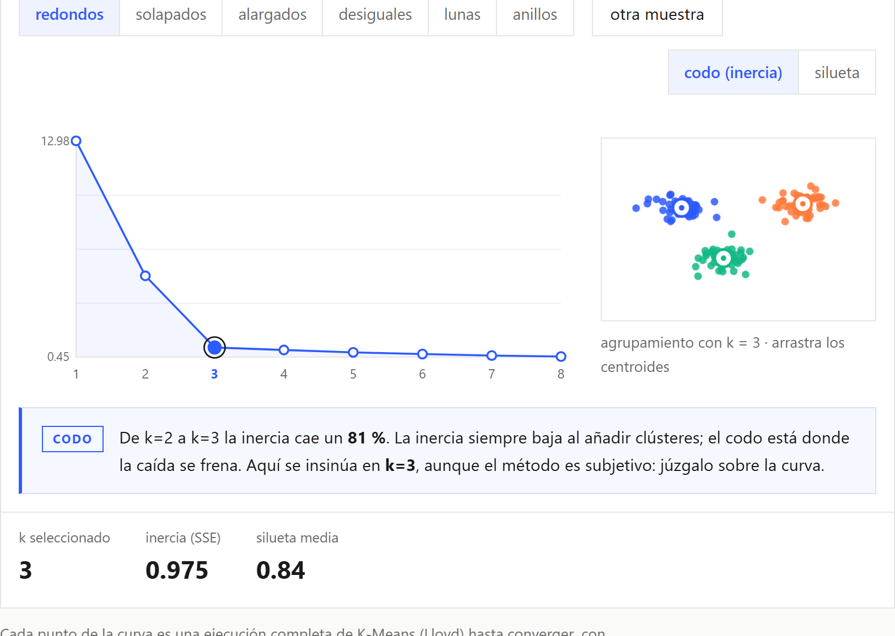

# 5 algoritmos de K-Means explicados

Aplicación web interactiva de una sola página que explica por qué existen
distintas variantes del algoritmo de agrupamiento K-Means y en qué se
diferencian: **Lloyd, MacQueen, Hartigan-Wong, Elkan y Fuzzy K-Means**.

Cada sección combina una explicación breve con un laboratorio interactivo en
el que se puede ejecutar el algoritmo paso a paso, modificar los datos y los
centroides, y comprobar su comportamiento real sobre seis tipos de muestras.

**Demo: [alexsaiz222.github.io/WebK-means](https://alexsaiz222.github.io/WebK-means/)**



## Contenido

1. **La esencia de K-Means.** El ciclo de asignación y actualización,
   ilustrado con un diagrama de tres fases cuyas coordenadas están calculadas
   con el algoritmo real.
2. **Cinco laboratorios, uno por variante.** Todos comparten el mismo
   instrumento: selector de muestras, `k` ajustable, línea de tiempo
   reproducible en ambos sentidos, narración de cada fase, métricas con curva
   de inercia, y puntos y centroides arrastrables que recalculan la ejecución
   desde la nueva configuración.
3. **¿Cómo se elige k?** Método del codo y coeficiente de la silueta sobre
   las mismas muestras. Al seleccionar un valor de `k` se muestra su
   agrupamiento, y los centroides de la vista previa pueden arrastrarse para
   observar el efecto de una mala inicialización sobre la curva.
4. **Guía de decisión.** Tabla comparativa con la forma de actualización, la
   fortaleza, el coste y el caso de uso de cada variante.

Cada laboratorio añade la interacción que aísla la diferencia de su algoritmo:

| Variante | Qué demuestra su laboratorio |
|---|---|
| Lloyd | Actualización por lotes. Las fronteras de Voronoi, activables sobre el lienzo, muestran por qué K-Means solo forma grupos convexos. |
| MacQueen | Procesamiento secuencial punto a punto. El control «barajar orden» evidencia la sensibilidad al orden de llegada de los datos. |
| Hartigan-Wong | Al señalar un punto se compara la ganancia por salir de su clúster con el coste de entrar en el mejor candidato: solo se traslada si reduce la inercia total. |
| Elkan | Ejecución en paralelo junto a Lloyd sobre los mismos datos y semilla: etiquetas idénticas con una fracción de los cálculos de distancia, gracias a la desigualdad triangular. |
| Fuzzy K-Means | Grados de pertenencia representados como mezcla de color, con un deslizador para el parámetro de borrosidad `m`. |

| | |
|---|---|
|  |  |

## Verificación

Las cinco implementaciones siguen la formulación de referencia documentada en
[`docs/ALGORITMOS.md`](docs/ALGORITMOS.md) y se validan con comprobaciones
ejecutables:

```bash
npm test   # requiere Node 22.6 o superior
```

Entre otras: Elkan produce exactamente las mismas etiquetas que Lloyd con
menos cálculos de distancia, barajar el orden altera el resultado de MacQueen
pero no el de Lloyd, la inercia nunca aumenta entre iteraciones, y con tres
grupos separados la silueta selecciona `k = 3`.

## Tecnología

[Astro](https://astro.build) y TypeScript, sin frameworks de UI ni
dependencias de ejecución. Los algoritmos son TypeScript puro aislado del DOM,
el dibujo se realiza con Canvas 2D y cada sección es un componente estático
con su propio script. La salida es completamente estática y se despliega en
GitHub Pages mediante el workflow del repositorio.

## Desarrollo

```bash
npm install
npm run dev      # servidor de desarrollo
npm run build    # build estática en dist/
npm run check    # comprobación de tipos
npm test         # comprobaciones de fidelidad
```

### Estructura

```
src/
  pages/index.astro        # la única página; orquesta las secciones
  layouts/Base.astro       # <head>, metadatos, estilos globales
  components/
    Nav.astro              # menú lateral con scroll-spy
    sections/              # un componente por sección
  lib/
    algorithms/            # una implementación por variante y evaluación de k
    sim/                   # renderer de canvas, Voronoi, sparkline
    data/                  # generadores de las seis muestras
  styles/global.css        # tokens de diseño y hoja global
docs/                      # guion, referencia teórica, diseño y roadmap
tests/fidelity.ts          # comprobaciones de fidelidad (npm test)
```

El directorio `docs/` contiene el guion de la página
([`PROYECTO.md`](docs/PROYECTO.md)), la referencia teórica de cada variante
([`ALGORITMOS.md`](docs/ALGORITMOS.md)), el sistema visual
([`DISENO.md`](docs/DISENO.md)) y el plan de desarrollo
([`ROADMAP.md`](docs/ROADMAP.md)).

## Autor y licencia

**Alejandro Manuel Saiz García** ·
[GitHub](https://github.com/AlexSaiz222) ·
[LinkedIn](https://www.linkedin.com/in/alejandrosaizgarc%C3%ADa)

Código bajo licencia [MIT](LICENSE). Proyecto desarrollado a partir de la
asignatura *Aprendizaje Automático No Supervisado*; los apuntes originales de
la asignatura no se distribuyen en este repositorio.
